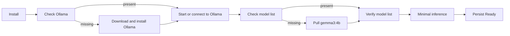

# Architecture (Phase 25 experimental branch)

Offline Writing Reviser retains one canonical action: Intelligent Revision on
`Ctrl+Alt+P`. Checkpoint 2 adds one bounded LanguageTool mechanical-correction
service and its private runtime. It does not add a hotkey, mode, router, or
second output path. The hotkey still uses the v0.4.0 model revision service
until the sequential pipeline is integrated in Checkpoint 4.

## Deterministic LanguageTool stage

`LanguageToolCorrectionService.correct(text)` performs exactly one explicit
`en-US` `/v2/check` request. It normalizes LanguageTool's UTF-16 offsets,
rejects malformed, overlapping, conflicting, non-mechanical, or unsafe edits,
and applies the remaining edits once in reverse-offset order. Deterministic
guards preserve numbers, dates, times, amounts, URLs, email addresses,
identifiers, quoted content, detectable names, negation, and modality. The
result retains original/corrected text, applied and skipped edit records, rule
and category identifiers, duration, runtime status, and structured failure
information.

There is no rule-routing policy, recursive check, LanguageTool/model choice,
or separate proofreading/paraphrasing service. Style suggestions are excluded;
the stage is limited to spelling, grammar, punctuation, capitalization, and
other mechanical corrections.

The application owns one reusable loopback server on a dynamic private port.
It launches only bundled Eclipse Temurin `javaw.exe` with no console and only
the bundled LanguageTool 6.6 server. Startup and requests are bounded, the
single application instance prevents duplicate owners, and shutdown terminates
only the recorded child process. The application prewarms the server in a
background thread and irreversibly disables restart after shutdown begins.

## End-to-end revision flow

```mermaid
flowchart LR
    A[Selected text] --> B[Ctrl+Alt+P]
    B --> C[Capture foreground/focus target]
    C --> D[Wait for modifiers to release]
    D --> E[Copy selection and restore clipboard]
    E --> F[Adaptive section plan]
    F --> G[Ollama / gemma3:4b]
    G --> H[Output sanitizer]
    H --> I[Semantic validation]
    I -->|unsafe or timed out| J[Keep original section]
    I -->|accepted| K[Use revised section]
    J --> L[Reconstruct full document]
    K --> L
    L --> M[Restore and verify target]
    M --> N[Paste complete result]
    N --> O[Restore current clipboard snapshot]
    O --> P[Ready]
```

The hidden windowed process acquires a per-session mutex, initializes metadata-only logging and a Qt event dispatcher, exposes a hidden Win32 control endpoint, then registers one Windows global hotkey. The hotkey callback captures the foreground and focused window handles synchronously. A single guarded worker prevents duplicate invocations, waits for Ctrl, Alt, and P to be physically released, and begins the clipboard state machine.

Selection acquisition prefers synchronous `WM_COPY` for standard controls and otherwise sends a scan-code Ctrl+C sequence. It waits for the clipboard sequence number to change and distinguishes an empty selection, copy timeout, and clipboard contention. The pre-capture clipboard snapshot is restored without overwriting a newer external clipboard change. Replacement restores and verifies the original target, snapshots the clipboard again, uses `WM_PASTE` or Ctrl+V, and conditionally restores that fresh snapshot.

No replacement occurs until the entire result has been reconstructed. Focus change, capture failure, provider failure, cancellation, or an invalid full reconstruction leaves the original selection intact.

## Revision engine and safety

`OfflineWritingService` uses the local Ollama loopback API with `gemma3:4b`. The prompt requests only the revised text and permits spelling, grammar, punctuation, vocabulary, clarity, redundancy, naturalness, and broader sentence restructuring when meaning is preserved. Already-correct text should be returned unchanged.

The sanitizer rejects commentary, prompt leakage, Markdown/code wrappers, control characters, truncation, excessive expansion/deletion, and damaged structure. The semantic validator and normalizers protect:

- numbers and their grammatical/semantic roles, currencies, amounts, dates, and times;
- URLs, email addresses, phone numbers, identifiers, quoted values, and casing-sensitive names;
- negation, modality, certainty, causal/temporal relations, question structure, reference, politeness, and intent;
- paragraph, list, heading, quote, indentation, and blank-line structure.

Validation is deliberately conservative. Rejected sections fall back to their source text, and a final reconstruction check can roll back individual changed sections. The controls reduce semantic risk but cannot prove equivalence.

## Adaptive large-document processing

The default maximum selection is 20,000 characters. Processing is sequential with a 700-character maximum section target. Boundaries are chosen in this order: paragraph, sentence, clause, then whitespace. If none exists before the target, the next whitespace is used, which avoids splitting protected URL/email/date/identifier tokens where practical.

Each Ollama request has an absolute 45-second deadline. A timed-out section gets one bounded retry; after the second timeout its original text is retained and later sections continue. An unsafe or malformed section is also retained. A slow section (about 75% of the deadline) reduces pending targets by half, down to approximately 300 characters. Provider/model unavailability stops processing because continuing cannot succeed.

All sections are reassembled byte-contiguously around their revised content, preserving separators and structure. Progress is announced as `Revising section n of m`, followed by `Completed` or `Completed with some sections unchanged`. Performance is hardware-dependent; roughly 2,000 words may take several minutes on slower machines. Benchmark timing is evidence for a specific machine, not a universal guarantee.

## Ollama provider

The provider discovers an existing Ollama executable, starts `ollama serve` hidden when the local API is unavailable, verifies the configured model, and calls the loopback generate endpoint with deterministic options. Ollama chooses CPU/GPU acceleration. Diagnostics report CPU, GPU, partial-GPU, or unknown from the runtime data Ollama exposes; vendor and backend may remain unknown.

## Application-level Model Setup

The application-level `ProvisioningController` owns one worker and persists 64-bit-safe byte totals and percentages atomically in `%LOCALAPPDATA%\OfflineWritingReviser\provisioning\state.json`. Its phases are checking Ollama, installing Ollama, starting Ollama, checking model, downloading model, verifying model, testing inference, ready, failed, and cancelled.

Closing or choosing Hide during active work hides the window without cancelling. The Start-menu setup shortcut sends a reconnect/focus message to the existing process; a provisioning mutex and controller guard prevent duplicate workers and duplicate model pulls. Interrupted Ollama/model downloads retain resumable data where available, and Retry resumes the missing stage. Ready, failure, progress, and retry state survive the window. While setup is active, the hotkey reports that setup is still in progress and directs the user to Model Setup.

The Qt dialog supplies accessible labels, focus order, byte/percentage details, and polite announcements when the stage changes or progress advances materially. Ready is persisted only after model-list verification and a minimal inference succeeds.

## Settings, diagnostics, and lifecycle

Settings use labelled Qt widgets and persist per-user JSON atomically. They expose installed-model selection, the single hotkey binding (shipped as `Ctrl+Alt+P`), request timeout, maximum input length, log location, and reset. The hidden control window focuses an existing Settings window and routes exit/restart requests to the running instance.

The Inno Setup installer is per-user, x64-compatible, and registers one quoted HKCU Run entry. Normal launches remain silent with no console, tray icon, or taskbar window. Duplicate application launches exit without spawning another worker. Restart performs bounded shutdown, unregisters the hotkey, joins workers, stops the application-owned LanguageTool child, then launches one replacement process. Uninstall requests clean exit and removes the private Java/LanguageTool files with the application directory, along with app files, shortcuts, and startup registration. It preserves shared Ollama, models, settings, and logs.

Logs contain metadata only: operation IDs, counts, target process/window metadata, timings, state transitions, provider/model status, and failure categories. Selected and revised text are not logged by default.
